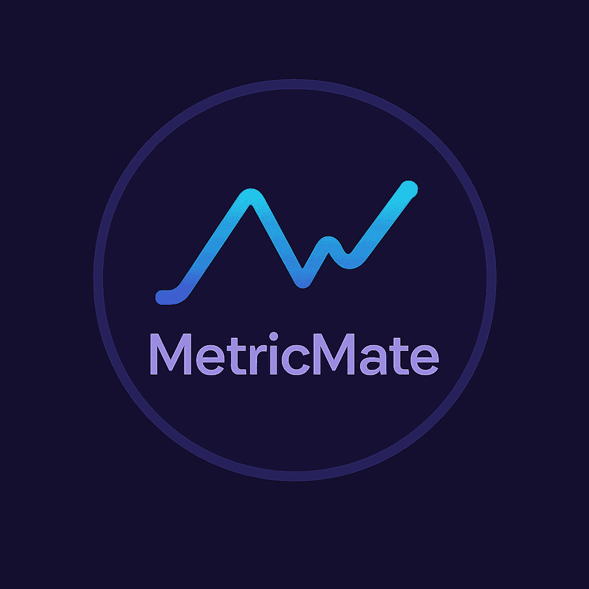

# 🎮 Metric Mate

A modern, user-friendly GUI application for analyzing and visualizing gaming performance metrics. Built with Python and Tkinter, **Metric Mate** features a sleek **Tokyo Night** theme and powerful tools for performance diagnostics and insights.



---

## 🚀 Features

### 📊 Interactive Data Visualization

- Real-time performance metrics display
- Multiple graph types: Temperature, CPU Usage, GPU Usage
- Customizable time ranges
- Zoom, pan, and reset capabilities

### 📈 In-Depth Analysis

- Statistical summaries (mean, median, std. dev.)
- Anomaly detection for outlier performance
- Trend tracking over time
- Correlation analysis across metrics

### 🎨 Modern UI

- Beautiful **Tokyo Night** dark theme
- Rounded corners & responsive layout
- Optimized for all screen sizes
- Intuitive controls for smooth user experience

### 📁 Smart Data Management

- Import CSV files
- Export graphs and analysis (PNG/text)
- Copy insights directly to clipboard

---

## 📦 Requirements

- Python 3.7 or higher
- Python packages:

  ```bash
  tkinter
  pandas
  matplotlib
  seaborn
  numpy
  tkcalendar
  scipy
  ```

---

## 🛠 Installation

1. **Clone the repository**

   ```bash
   git clone https://github.com/rafay99-epic/MetricMate.git
   cd MetricMate
   ```

2. **Create a virtual environment (recommended)**

   ```bash
   python -m venv venv
   source venv/bin/activate      # On Windows: venv\Scripts\activate
   ```

3. **Install dependencies**

   ```bash
   pip install -r requirements.txt
   ```

---

## ▶️ Usage

1. **Run the application**

   ```bash
   python gaming_analyzer_gui.py
   ```

2. **Load your performance data**

   - Click **"Select CSV File"** to import
   - Supported format: CSV with performance metrics

3. **Analyze**

   - Choose analysis type and time range
   - Click **"Analyze"** to generate graphs

4. **Export**

   - Save graphs (PNG)
   - Export text summary
   - Copy results to clipboard

---

## 📂 CSV Format

Your CSV should include these columns:

- `Time` _(optional but recommended)_
- `CPU Temperature`, `GPU Temperature`
- `CPU Usage`, `GPU Usage`

**Example:**

```csv
Time,CPU Temperature,GPU Temperature,CPU Usage,GPU Usage
2024-01-01 12:00:00,65,70,45,60
2024-01-01 12:01:00,67,72,50,65
```

---

## 🔍 Feature Breakdown

### Graph Types

- **Temperature**: Track CPU & GPU heat levels
- **CPU/GPU Usage**: Visualize workload
- **All Metrics**: Combined graph
- **Correlation**: Analyze inter-metric relationships
- **Heatmap**: Intensity mapping over time
- **Trends**: Long-term performance evolution

### Analysis Types

- **Statistical Summary**
- **Trend Analysis**
- **Anomaly Detection**
- **Time-Filtered Analysis**

### UI Highlights

- Responsive layout
- Zoom, pan, reset on all graphs
- Smooth dark theme design
- Clean and organized interface

---

## 🧩 Roadmap

- [ ] Live performance monitoring
- [ ] More input format support (e.g., JSON, XML)
- [ ] Custom alert system
- [ ] Performance benchmarking module
- [ ] Additional export formats (PDF, XLSX)
- [ ] Plugin system for extensibility

---

## 🙌 Contributing

Pull requests are welcome! For major changes, please open an issue first to discuss what you’d like to change.
See [CONTRIBUTING.md](CONTRIBUTING.md)

---

## 📄 License

This project is licensed under the MIT License. See the [LICENSE](LICENSE) file for details.

---

## 💬 Support

If you encounter bugs or have suggestions:

1. Check the [Issues](https://github.com/rafay99-epic/MetricMate/issues) page.
2. Open a new issue if it’s not already reported.

---

## 🙏 Acknowledgments

- Inspired by the [Tokyo Night](https://github.com/enkia/tokyo-night-vscode-theme) theme
- Python open-source community
- All contributors and users of Metric Mate

---

## 👨‍💻 Author

**Abdul Rafay**
A passionate full-stack developer and machine learning engineer. I love creating tools that blend elegant UI with powerful backend logic, especially in the performance and data visualization domain.
🌐 **Portfolio**: [rafay99.com](https://rafay99.com)
📫 **Email**: [99marafay@gmail.com](mailto:99marafay@gmail.com)

---

Let me know if you want a badge section (e.g., Python version, License, GitHub stars) or a live demo GIF embedded.
